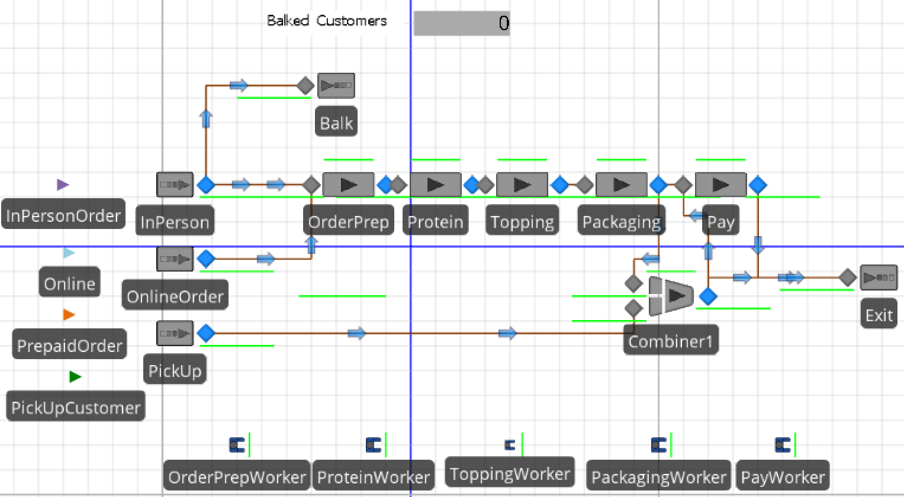
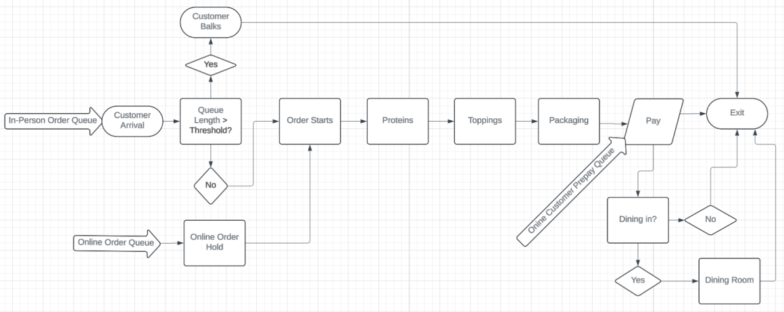
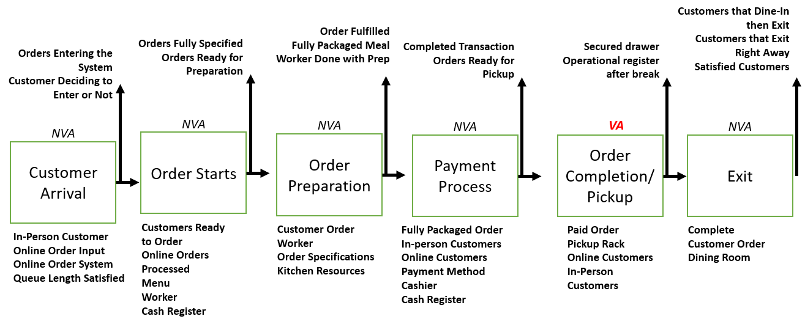
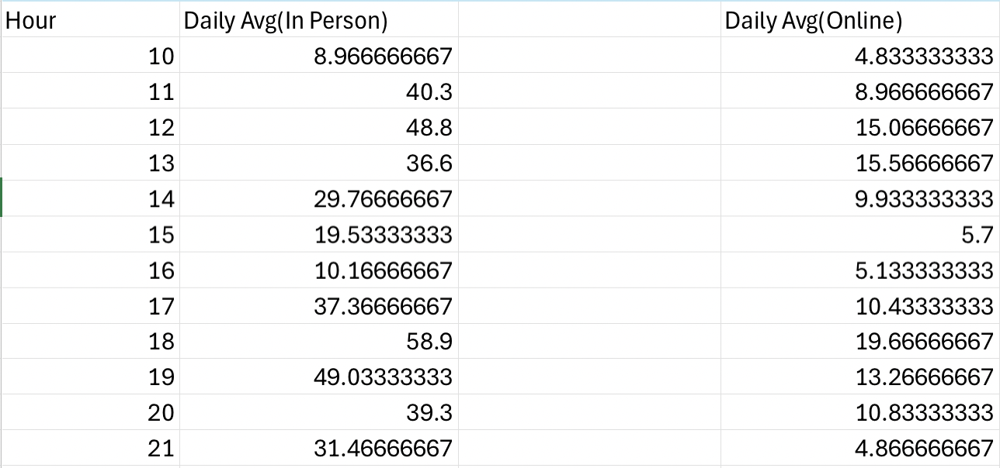
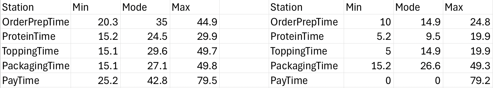
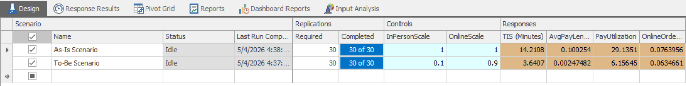

# Restaurant Operations Simulation

## Overview

Developed a discrete-event simulation of a five-station restaurant operation using Simio to evaluate how operational policies influence customer flow and system performance. The model simulated **16,000 customer orders** across both in-person and online ordering workflows using real operational data.

---

## Objective

The objective of this project was to evaluate how changes in customer demand allocation and operational policies affect restaurant throughput, queue lengths, resource utilization, and customer time in system while maintaining a **90% service-level target**.

---

## Tools & Methods

- Simio
- Microsoft Excel
- Discrete-event Simulation
- Statistical Input Analysis
- Queuing Analysis

---

## Model Features

- Five sequential service stations
- Separate in-person and online customer workflows
- Time-varying customer arrival schedules
- Station-specific service time distributions
- Resource-constrained worker assignments
- Customer balking behavior
- Promise-time logic for online orders
- Priority queuing
- Multiple simulation replications for scenario comparison
- Staffing scenario analysis

---

## Simio Model

The facility model represents customer flow through five sequential processing stations while incorporating worker movement, queuing behavior, and operational constraints.

---

## Process Flow

The process flow illustrates how customer orders move through the restaurant, including separate paths for in-person customers, prepaid online orders, and online customers paying in person. It helped capture customer movement from order placement through meal completion while accounting for operational decision points and routing logic.

---

## High-Level Process Map

The process map summarizes the end-to-end operational workflow from customer arrivals through order completion and restaurant exit.

---

## Data Analysis

Historical restaurant data spanning a **30-day** period was analyzed to characterize customer demand and generate simulation inputs.

The analysis included:

- Time-varying customer arrival patterns
- Station specific processing-time distributions
- Order-type demand allocation
- Simulation input parameter development

### Hourly Arrival Analysis

### Service Time Analysis

---

## Simulation Experiments

**30** independent simulation replications were conducted to compare the restaurant's existing operation against an alternative operating policy that favored online ordering.

Performance was evaluated using key operational metrics including:

- Customer TIS
- Queue lengths
- Resource utilizatiin
- Service-level performance

---

## Key Results

The proposed operating policy substantially improved customer flow while maintaining **90% service-level target**.

| Metric | Original System | Proposed System |
|---------|----------------:|----------------:|
| Average Time in System | 14.21 min | 3.64 min |
| Pay Station Queue Length | 0.100 | 0.002 |
| Pay Station Utilization | 29.14% | 6.16% |

---

## Skills Demonstrated

- Discrete-Event Simulation
- Process Modeling
- Queuing Systems
- Operations Research
- Capacity Planning
- Experimental Design
- Statistical Input Analysis
- Simulation Verification & Validation

---

## Repository Contents

- FinalSimioFreshMexProject.spfx — Simio simulation model
- SimioFreshMexDataset.xlsx — Historical dataset used for model inputs
- images/ — Process maps, simulation screenshots, and experiment figures

---

## Project Attribution

This simulation was completed as part of a team project. This repository highlights my individual contributions.

My contributions included:
- Building the Simio simulation model
- Implementing simulation logic and routing behavior
- Analyzing operational performance
- Conducting simulation experiments
- Supporting model verification and validation

---

## Future Improvements

Potential future enhancements include:

- Dynamic staffing optimization
- Additional operational policy experiments
- Simulation-based optimization of staffing levels and resource allocation
- Analysis of alternative customer demand scenarios
